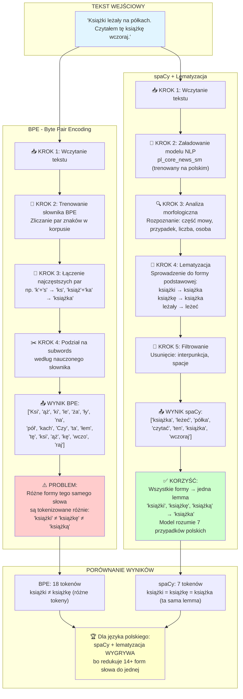

# Porównanie Tokenizacji: BPE vs spaCy + Lematyzacja

## Diagram Porównawczy



## Szczegółowe Wyjaśnienie

### BPE (Byte Pair Encoding)

**Zalety:**
- ✅ Uniwersalny - działa dla każdego języka
- ✅ Szybki trening i wykonanie
- ✅ Radzi sobie z rzadkimi słowami przez subwords

**Wady dla języka polskiego:**
- ❌ Nie rozumie gramatyki
- ❌ Każda forma fleksyjna → inne tokeny
- ❌ "książka" (mianownik) ≠ "książki" (dopełniacz) ≠ "książką" (narzędnik)
- ❌ Dla języka fleksyjnego (7 przypadków) = ogromny słownik

**Przykład:**
```
Tekst:      "Mam książkę. Czytam książkę. To jest książka."
BPE tokens: ['Ma', 'm', 'ksi', 'ąż', 'kę', 'Czy', 'ta', 'm', 'ksi', 'ąż', 'kę', 'To', 'jest', 'ksi', 'ąż', 'ka']
Problem:    'książkę' i 'książka' → różne tokeny!
```

### spaCy + Lematyzacja

**Zalety:**
- ✅ Rozumie morfologię polskiego
- ✅ Wszystkie 14+ form słowa → jedna lemma
- ✅ Lepsze embeddingi (podobne znaczenie → podobne wektory)
- ✅ Mniejszy słownik (książka, książki, książkę → książka)

**Wady:**
- ❌ Wymaga zainstalowania modelu językowego (pl_core_news_sm)
- ❌ Wolniejszy (ale cache rozwiązuje problem!)

**Przykład:**
```
Tekst:         "Mam książkę. Czytam książkę. To jest książka."
spaCy tokens:  ['mieć', 'książka', 'czytać', 'książka', 'to', 'być', 'książka']
Korzyść:       wszystkie formy 'książka' → jedna lemma 'książka'!
```

## Dlaczego spaCy Wygrywa dla Języka Polskiego?

Polski to **język fleksyjny** z 7 przypadkami gramatycznymi:

| Przypadek | Liczba pojedyncza | Liczba mnoga |
|-----------|-------------------|--------------|
| Mianownik | książka           | książki      |
| Dopełniacz| książki           | książek      |
| Celownik  | książce           | książkom     |
| Biernik   | książkę           | książki      |
| Narzędnik | książką           | książkami    |
| Miejscownik| książce          | książkach    |
| Wołacz    | książko           | książki      |

**Dla BPE:** 14 różnych form = 14+ różnych zestawów tokenów
**Dla spaCy:** 14 różnych form = 1 lemma (`książka`)

## Wydajność

### BPE
- ⚡ Szybki: ~15 sekund na korpus
- 🗂️ Duży słownik przez formy fleksyjne

### spaCy + Cache
- 🐌 Bez cache: ~120 sekund
- ⚡ Z cache: ~2 sekundy (60x szybciej!)
- 🗂️ Mały słownik przez lematyzację

## Podsumowanie

| Kryterium | BPE | spaCy + Lematyzacja |
|-----------|-----|---------------------|
| Rozumienie polskiego | ❌ Nie | ✅ Tak |
| Formy fleksyjne | ❌ Różne tokeny | ✅ Jedna lemma |
| Szybkość (z cache) | ⚡⚡⚡ | ⚡⚡⚡ |
| Jakość embeddingów | ⭐⭐ | ⭐⭐⭐⭐⭐ |
| **Rekomendacja dla polskiego** | ❌ | ✅ **WYBIERZ TO!** |

## Pliki w Projekcie

- `train-doc2vec-bpe.py` - Trenowanie z BPE
- `train-doc2vec-spacy.py` - Trenowanie z spaCy + cache
- `compare-all-tokenization.py` - Interaktywne porównanie
- `visualize-doc2vec-spacy.py` - Wizualizacja wyników spaCy
